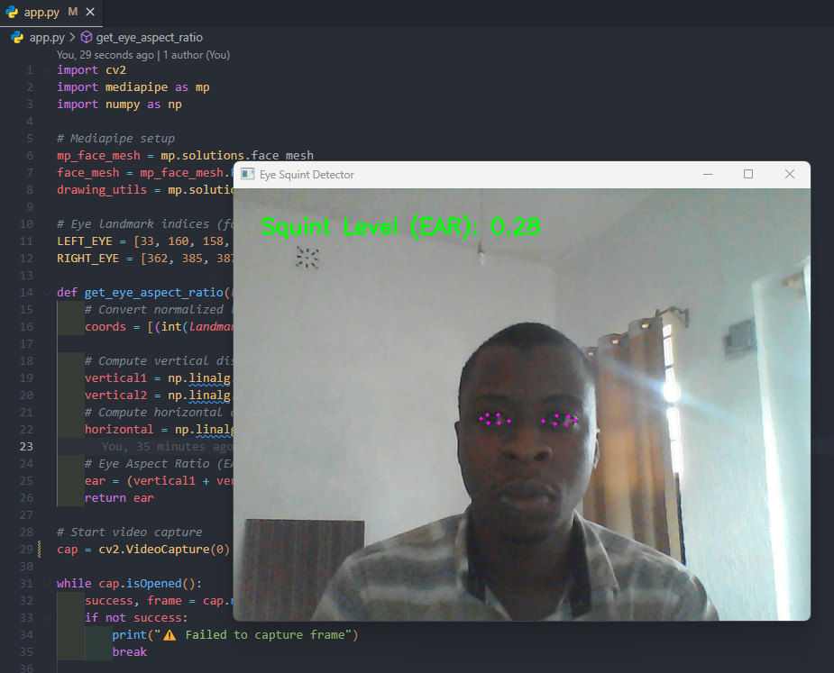

# 👁️ Eye Squint Detection using Mediapipe

This Python project detects and quantifies the level of eye squinting in real time using a webcam and Google's Mediapipe face mesh.

---

## 📸 Demo

 <!-- Optional: Add a screenshot or gif -->

---

## 📦 Features

- Real-time eye squint detection using Eye Aspect Ratio (EAR)
- Uses Mediapipe’s facial landmarks (iris-refined)
- Simple to run on most machines with a USB camera
- Press `q` to quit the camera view

---

## 🧠 Requirements

- Python 3.10.x  
- External or built-in webcam  
- Works on Windows, macOS, or Linux

---

## 🚀 Getting Started

### 1. Clone the Repository

```bash
git clone https://github.com/MwarandusLab/EyeSquinting_Project.git
cd EyeSquinting_Project
```
### 2. Create a Virtual Environment
Make sure you're using Python 3.10:
```bash
python -m venv venv
```
Activate the environment:
- On Windows PowerShell:
```bash
.\venv\Scripts\Activate.ps1
```
- On macOS/Linux:
```bash
source venv/bin/activate
```
### 3. Install Dependencies
```bash
pip install mediapipe opencv-python
```
### 4. Run the Project
```bash
python app.py
```
### 🧮 How It Works
This project calculates the Eye Aspect Ratio (EAR) using 6 key landmarks for each eye. The smaller the EAR, the more squinted the eye is.
